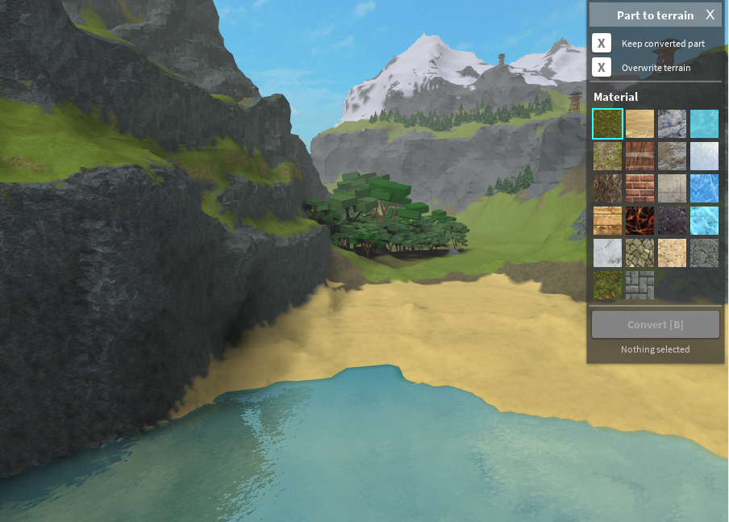

<h1 align="center">Quenty's Part to Terrain</h1>

Converts part to terrain. Has specific options to keep existing terrain instead of overriding it. 

You can find the published version [here](https://www.roblox.com/library/1618177131/Quentys-Part-to-Terrain).

### Installing

1. Navigate to https://www.roblox.com/library/1618177131/Quentys-Part-to-Terrain
2. Press Install

### Features

* Preserve existing terrain underneath
* Preserve converted parts
* ALT to select materials from world, like other terrain tools
* Shortcut key binding to convert selected part
* Nice UI

### UI

Here's an example of the UI



### Building the plugin
This plugin is built with [Rojo](https://github.com/LPGhatguy/rojo).

Run 

```rojo serve```

from the root directory and then sync using the Rojo plugin.


### Syntax checking
Syntax checking is done with LuaCheck